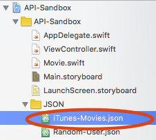

In this exercise, we'll be dealing with data from iTunes' top 25 movie feed. We won't be making a real network request yet so we saved an archive of this data to a file on June 16th, 2016.

> [action]
> Click [here](https://itunes.apple.com/us/rss/topmovies/limit=25/json) to view the current top movies.

Woah. That's a bit overwhelming, isn't it? How about you view the pretty archive we made for you...

> [action]
> Open up `iTunes-Movies.json` in the `JSON` folder and take a look at the file. Warning, it's much easier to read, but it's still pretty long. There are 25 movies in there!
>
> You'll want to reference this often as you complete this exercise.
>


# Let's parse some data

Did you notice how messy it was in the last exercise when we tried to save all that data to variables? It'd get really bad, really quickly if we were dealing with a bunch of items!

The bad news is, we now have 25 items to read in. The good new is, we are about to learn how to do this cleanly!

## Let's create a struct

We have created a `Movie` struct for you inside of `Movie.swift`. We have included an incomplete `init?` method because you'll need to fill it in soon! Can you see where this is going? Initializers that accept `JSON` objects will allow you to encapsulate the data cleanly! In this case we are using a struct, but you can use classes for this purpose as well. We chose a struct because the all of the data is simple and we don't plan to update it once it is initialized.

```
struct Movie {
    let name: String
    let rightsOwner: String
    let price: Double
    let link: String
    let releaseDate: String

    init?(json: JSON) {
        self.name = ""
        self.rightsOwner = ""
        self.price = 0
        self.link = ""
        self.releaseDate = ""
    }
}
```

## Explore the `iTunes-Movies.json` file

Now that we know what data we care about, open up `iTunes-Movies.json` again and take a look at it's formatting. You should notice that inside of `"feed"` there is an `"entry"` key that contains an array of all the movies. How can you get the `name`, `rightsOwner`, `price`, and `releaseDate` if you were given an element of this array?

> [action]
Grab a pen and some paper. Write down the dictionary path to each value you need to read from your initializer.
>
> The first movie has the following values:
>
- `name = "Zootopia"`
- `rightsOwner = "© 2016 Disney Enterprises, Inc. All Rights Reserved"`
- `price = 19.99`
- `link = "https://itunes.apple.com/us/movie/zootopia/id1084138493?uo=2"`
- `releaseDate = "March 4, 2016"`

## Implement the initializer

Hopefully you were you able to navigate the JSON and find all the values.

> [challenge]
> Finish implementing the initializer for `Movie` by navigating the `JSON` and then uncomment the print statement in `exerciseTwo`. If completed correctly, the following should print to the console...
>
`"The top movie is Zootopia by © 2016 Disney Enterprises, Inc. All Rights Reserved. It costs $19.99 and was released on March 4, 2016. You can view it on iTunes here: https://itunes.apple.com/us/movie/zootopia/id1084138493?uo=2"`
>
> Keep in mind that you'll need to cast the value you receive for price. Pay close attention to arrays and make sure to unwrap your values!

# More challenges!

## Create an array of the top movies

Now that you have a working `Movie` struct, let's load in all the movies!

> [challenge]
> Create an array of `Movie` structs in `exerciseThree` and populate it with all the movies in `iTunes-Movies.json`. We have provided `allMoviesData`, an array of `JSON` objects for you to use.

## Which movies are Disney movies?

> [challenge]
> Print out the titles of the two Disney movies in `exerciseThree`. A movie is considered to be a "Disney movie" if `rightsOwner` contains the `String` "Disney". Iterate over all the values in `allMovies` to check!

## Which movies are less than $15?

> [challenge]
> Print out the titles and prices of each movie that costs less than $15. Iterate over all the values in `allMovies` to check!

## Which movies were released in 2016?

> [challenge]
> Print out the titles and release date of each movie released in 2016. Iterate over all the values in `allMovies` to check!

print("The following movies were released in 2016...")

# Wrapping up

Isn't is nice to deal with structs? Can you imagine how nasty the code would look if you were iterating over `JSON` objects in each of those challenges? Make sure to _always_ create a struct or class to encapsulate the data you read from JSON responses! It will make your code cleaner and your life easier!
