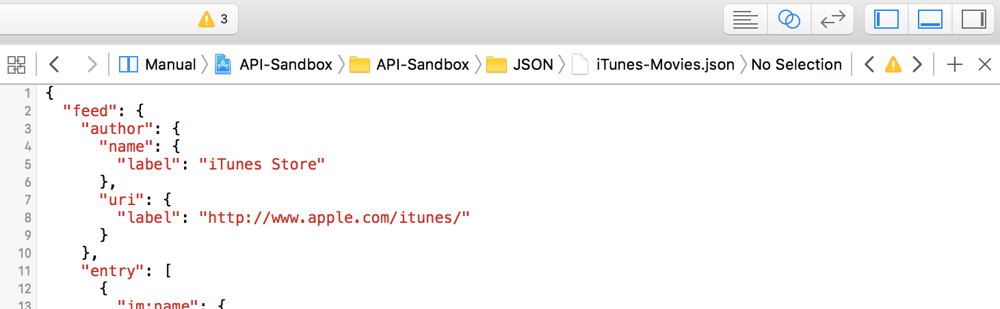

In this exercise, we'll be dealing with data from iTunes' top 25 movie feed.

> [action]
> Click [here](https://itunes.apple.com/us/rss/topmovies/limit=25/json) to view the current top movies.

Woah. That's a bit overwhelming, isn't it? We won't be making real network requests from iOS just yet, so instead we saved a copy of this data from June 16th, 2016 to a file. How about we try viewing that?

> [action]
> Open `iTunes-Movies.json` in the `JSON` group and take a look at the file. It's much easier to read, but it's still pretty long. There are 25 movies in there!
>


> You'll want to reference this often as you complete this exercise. In fact, it might be nice to open this file in the *Assistant Editor* so that it's easy to reference as you do your coding in the *Standard Editor*.
> 
> 

# Let's parse some data

Did you notice how messy it was in the last exercise when we tried to save all that data to different variables? It'd get really bad, really quickly if we were dealing with more data!

The bad news: we now have 25 items to read in. The good news: we are about to learn how to do this much more cleanly!

## Let's create a struct

We have created a `Movie` struct for you inside of `Movie.swift`. Go ahead and open that now. Notice that we have created properties for `name`, `rightsOwner`, `price`, `link` and `releaseDate`. That's the information that we most care about for each movie. 

We have included an incomplete `init` method - it'll be up to you to fill it in. Notice that the `init` method requires some `JSON` to be passed as a parameter. Can you see where this is going? Initializers that accept `JSON` objects will allow us to encapsulate the data cleanly! We can create a new `Movie` for each movie in the `iTunes-Movies.json`, and by passing the relevant chunk of JSON data to the `Movie` initializer, we can have the `Movie` take care of extracting the relevant information from the JSON and using it to populate its properties.

In this case we are using a struct, but you can use classes for this purpose as well. We chose a struct because the all of the data is simple and we don't plan to update it after it is initialized.

```
struct Movie {
    let name: String
    let rightsOwner: String
    let price: Double
    let link: String
    let releaseDate: String

    init(json: JSON) {
        self.name = ""
        self.rightsOwner = ""
        self.price = 0
        self.link = ""
        self.releaseDate = ""
    }
}
```

## Explore the `iTunes-Movies.json` file

Now that we know which pieces of data we care about, open up `iTunes-Movies.json` again and take a look at the format. You should notice that inside of `"feed"` there is an `"entry"` key that contains an array of all the movies. How can you get the `name`, `rightsOwner`, `price`, `link` and `releaseDate` if you were given an element of this array?

> [action]
Grab a pen and some paper. Write down the dictionary path to each value you need to read from your initializer.
>
> The first movie has the following values:
>
- `name = "Zootopia"`
- `rightsOwner = "© 2016 Disney Enterprises, Inc. All Rights Reserved"`
- `price = 19.99`
- `link = "https://itunes.apple.com/us/movie/zootopia/id1084138493?uo=2"`
- `releaseDate = "March 4, 2016"`

## Implement the initializer

Hopefully you were you able to navigate the JSON and find all the values.

> [challenge]
> Finish implementing the initializer for `Movie` by navigating the `JSON`. Assume that the `JSON` passed to the initializer is just one element from the `entry` array. To test your implementation, uncomment the print statement in `exerciseTwo`. If completed correctly, the following should print to the console:
>
`"The top movie is Zootopia by © 2016 Disney Enterprises, Inc. All Rights Reserved. It costs $19.99 and was released on March 4, 2016. You can view it on iTunes here: https://itunes.apple.com/us/movie/zootopia/id1084138493?uo=2"`
>
> Keep in mind that you'll need to cast the value you receive for price. Pay close attention to arrays and make sure to unwrap your values!

# More challenges!

## Create an array of the top movies

Now that you have a working `Movie` struct, let's load in all the movies!

> [challenge]
> In `exerciseThree` create a `Movie` for each movie in `iTunes-Movies.json` and use those to populate the `allMovies` array. We have provided `allMoviesData`, an array of `JSON` objects for you to use.

## Which movies are Disney movies?

> [challenge]
> Print out the names of the two Disney movies in `exerciseThree`. A movie is considered to be a "Disney movie" if `rightsOwner` contains the `String` `"Disney"`. Iterate over all the values in `allMovies` to check!

<!-- html comment to break boxes -->

> [solution]
> Your output should look like this:
> 
	The following movies are Disney movies:
	Zootopia
	Finding Nemo

## Which movies are less than $15?

> [challenge]
> Print out the name and price of each movie that costs less than $15. Iterate over all the values in `allMovies` to check!

<!-- html comment to break boxes -->
> [solution]
> Your output should look something like this:
> 
```
The following movies are cost less than $15:
London Has Fallen: $14.99
10 Cloverfield Lane: $14.99
The Big Short: $9.99
13 Hours: The Secret Soldiers of Benghazi: $14.99
Whiskey Tango Foxtrot: $14.99
Deadpool: $14.99
Hello, My Name Is Doris: $14.99
Eye In the Sky: $14.99
Eddie the Eagle: $14.99
Dirty Grandpa (Unrated): $9.99
Hail, Caesar!: $14.99
How to Be Single: $14.99
Now You See Me: $12.99
Daddy's Home: $9.99
My Big Fat Greek Wedding 2: $14.99
The Revenant: $14.99
The Clan: $14.99
Tumbledown: $12.99
Triple 9: $14.99
The Conjuring: $14.99
Kung Fu Panda 3: $14.99
Be Somebody: $9.99
```

## Which movies were released in 2016?

> [challenge]
> Print out the name and release date of each movie released in 2016. Iterate over all the values in `allMovies` to check!

<!-- html comment to break boxes -->

> [solution]
> Your output should look something like this:
> 
```
The following movies were released in 2016:
Zootopia was released on March 4, 2016
London Has Fallen was released on March 4, 2016
10 Cloverfield Lane was released on March 11, 2016
13 Hours: The Secret Soldiers of Benghazi was released on January 15, 2016
Whiskey Tango Foxtrot was released on March 4, 2016
Deadpool was released on February 12, 2016
Hello, My Name Is Doris was released on March 11, 2016
Eye In the Sky was released on March 11, 2016
Eddie the Eagle was released on February 26, 2016
Dirty Grandpa (Unrated) was released on January 22, 2016
Hail, Caesar! was released on February 5, 2016
How to Be Single was released on February 19, 2016
My Big Fat Greek Wedding 2 was released on March 25, 2016
The Clan was released on February 19, 2016
Tumbledown was released on February 12, 2016
Triple 9 was released on February 26, 2016
Kung Fu Panda 3 was released on January 29, 2016
Be Somebody was released on June 10, 2016
```
# Wrapping up

Isn't is nice to deal with structs? Can you imagine how nasty the code would look if you were iterating over `JSON` objects in each of those challenges? Make sure to _always_ create a struct or class to encapsulate the data you read from JSON responses! It will make your code cleaner and your life easier!
