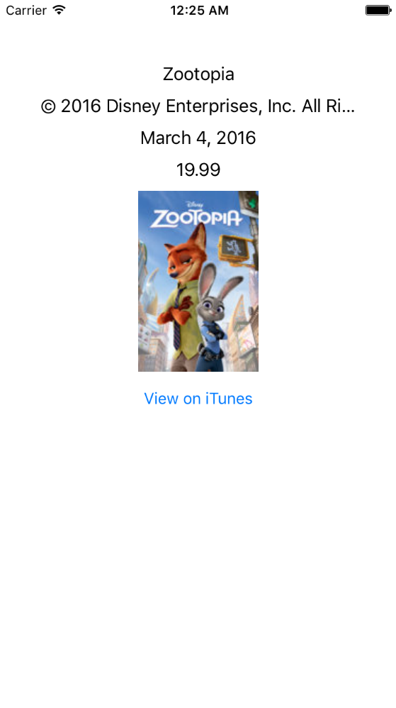

In this exercise, we'll be dealing with _live data_ from iTunes' top 25 _music_ feed. We'll make a real network request and get the current data!

Your mission now is to use the `Movie` struct we created to show information about a random movie from iTune's top 25!

> [info]
> We won't be providing any layout hints beyond the skeleton already in `Main.storyboard`, that part is up to you. If you complete everything and don't make any layout changes, you'll end up with something like this.
>
> 

# Making API calls

Open up `ViewController.swift` and take a look at the code provided.

> [action]
> Comment out or remove the calls to `exerciseOne()`, `exerciseTwo()`, and `exerciseThree()` in `viewDidLoad()`.

The code we care most about is this:

```
let apiToContact = "https://itunes.apple.com/search"
// This code will call the iTunes top 25 movies endpoint listed above
Alamofire.request(.GET, apiToContact).validate().responseJSON() { response in
    switch response.result {
    case .Success:
        if let value = response.result.value {
            let json = JSON(value)

            // Do what you need to with JSON here!
            // The rest is all boiler plate code you'll use for API requests


        }
    case .Failure(let error):
        print(error)
    }
}
```

We are using `Alamofire`, another Cocoapod, to manage our network request. This code is the general format you will use for all network requests! It does the following:

1. Creates a `GET` request to `apiToContact`
1. Validates the request to ensure it worked
1. Passes the JSON response to a closure
1. In the closure we handle success and failure with a switch statement
1. If successful, we create a `JSON` object from the response's result's value
1. After that, you can work with it just like you did on the previous exercises!

Remember, this is a closure. Network requests are asynchronous. This means that the rest of the code after the request will continue running. Once the data is received, the code within the closure runs. Depending on your network connection, this can be a tiny delay or even seconds long.

> [info]
> `GET` requests are calls to APIs that ask for data. Conversely, `POST` requests send data to the server. You'll learn a bit more about `POST` requests on the next page.

# Getting started

This will be the most open ended tutorial you've gone through so far. Fear not, we have faith that you'll be able to complete it!

You'll likely want to add an instance variable to hold a `Movie` struct. In side of your body, choose a random movie and parse it to that instance variable. From there, you can start filling out the labels (we already made the necessary `IBOutlet`s for you).

If you get lost, refer back to exercises two and three in `Challenges.swift`.

# Adding the poster

Well, we never actually parsed the poster from the JSON object. Look back at `iTunes Movie.json` and figure out where it's located. For Zootopia, you are looking for a value of `"http://is3.mzstatic.com/image/thumb/Video30/v4/89/c0/0a/89c00a09-016b-6297-102d-6f451310ee17/pr_source.lsr/170x170bb-85.jpg"`. Add a poster constant to your `Movie` struct and update your `init` to populate the poster.

Once you have it parsed, you can use `loadPoster` method we have included to add it to your view. `loadPoster` uses the `AlamofireImage` component's `af_setImageWithURL` to update the image view. This asynchronously downloads the image and puts it in the `posterImageView` for us! :)

# Programming the button

The `View on iTunes` button is connected to `viewOniTunesPressed`. Fill in this method to open up the movie on iTunes.

> [info]
> You can open StackOverflow.com in Safari with:
>
```
UIApplication.sharedApplication().openURL(NSURL(string: "http://www.stackoverflow.com")!)
```
>
> Unfortunately, the simulator blocks access to iTunes! You'll need to test on device to see if this is working.
